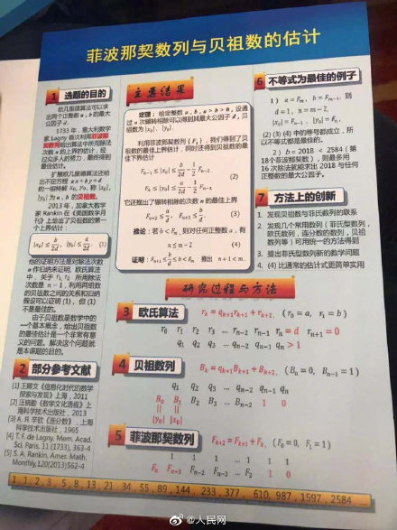

## 2019-08-08 四 立秋 微晴
不知不觉，已经是2019年的秋天了……

### Alpine Linux
Alpine 的意思是“高山的”，比如 Alpine plants高山植物，Alpine skiing高山滑雪、the alpine resort阿尔卑斯山胜地。

https://alpinelinux.org/ : “Small！Simple！Secure！Alpine Linux is a security-oriented, lightweight Linux distribution based on musl libc and busybox.”

### CSS Grid Layout
```
.wrapper {
  display: grid;
  grid-template-columns: repeat(3, 1fr);
  grid-auto-rows: 200px;
}
```
CSS网格布局和弹性盒(flex)布局的主要区别在于弹性盒布局是为一维布局服务的（沿横向或纵向的），而网格布局是为二维布局服务的（同时沿着横向和纵向）。

嵌套网格节:一个网格元素可以也成为一个网格容器。

### DOS Defender game
DOS Defender is an x86 real mode DOS game   https://github.com/skeeto/dosdefender-ld31  


## 2019-08-10 六 阴
2019秋季开发者大书签。在浏览器里收集书签，这是一个很好玩的游戏，完全不亚于植物大战僵尸，比收集太阳花更丰富更有乐趣。我现在Firefox developer version 69.0b11 (32-bit)收集，因为firefox的Sidebar用起来比chromium方便些。首先在书签栏里建几个目录: java, python, html js css markdown, C, Android, games, music, video,!,...

## 2019-08-13 二 凌晨大雨 白天晴偏阴

IOI 2019——国际信息学奥林匹克竞赛，已经落下帷幕。
中国队四名选手，揽获三金一银，总冠军则再度被美国队华人选手摘走。
此次中国队选手全部第一次参赛，他们分别是：
钟子谦，福建省福州第三中学，获得金牌第4名；
杨骏昭，江苏省南京外国语学校，获得金牌第5名；
高嘉煊，中山市中山纪念中学，获得金牌第20名；
王修涵，四川省成都市第七中学，获得银牌第21名。
而今年的IOI冠军，再次被17岁的华人美国队员Benjamin Qi拿走。
至此，他已经连续获得两次IOI冠军，被网友称为“神犇”，从10岁时，父母就开始带他去参加数学比赛，开始展现出数学天才的一面。

第 30 届国际信息学奥林匹克竞赛（IOI 2018）于2018年9月1日至9月8日在日本筑波举行。
本次比赛中国队参赛选手分别为：
杨懋龙（长郡中学）、
朱震霆（安徽师范大学附属中学）、
陈江伦（长郡中学）、
任轩笛（绍兴市第一中学）
IOI 2018 创纪录的吸引了来自 87 个国家和地区的 341 多名信息学选手和 173 位团队领队参与。

## 2019-08-14 三 阴

mathpix  JChemPaint   Maple  Julia

```
curl -X POST https://api.mathpix.com/v3/latex \
    -H 'app_id: trial' \
    -H 'app_key: 34f1a4cea0eaca8540c95908b4dc84ab' \
    -H 'Content-Type: application/json' \
    --data '{ "url": "data:image/jpeg;base64,'$(base64 -i limit.jpg)'" }'
```

gookey : java , chemistry , molecule

海龟绘图 Lib/turtle.py     turtledemo    tkinter GUI

## 2019-08-15 四 阴
赵德力 飞行摩托 东莞汇天无人机有限公司总经理

温州世贸中心，目前浙江第一高楼

开箱569元，小米天文望远镜

北京时间8月11日，2019年第五届深圳福田全国象棋公开赛在深圳市福田区战罢。最终卫冕冠军、业余悍将陆安京再次夺冠，实现了连续的第二次登顶，在江湖中声名大起。强力战手黄文俊收获亚军，四架马车之一的蔡佑广拿下季军，后起之秀欧照芳取得殿军。5-16名：陈树雄、李进、朱少钧、刘昱、林辉宇、刘云达、文汉忠、张雄、简嘉康、邹海涛、梁运龙、崔航。秦铭泽、石涛榕、周梓康、陈永豪分获少儿A、B、C、D组桂冠。

https://github.com/vuejs/vue-devtools#vue-devtools
https://github.com/vuejs/vue-cli/edit/docs/docs/guide/README.md


unpkg is a fast, global content delivery network for everything on npm. Use it to quickly and easily load any file from any package using a URL like: `unpkg.com/:package@:version/:file`  
https://unpkg.com/marked@0.3.6  
The unpkg CDN is powered by Cloudflare, one of the world's largest and fastest cloud network platforms.  
https://unpkg.com/browse/vue@2.6.10/

cdnjs: The #1 free and open source CDN built to make life easier for developers. https://cdnjs.com


∷想做一个js pkg快速阅读器，罗列unpkg与cdnjs中的代码，并可编辑保存为副本

idea: 基于examples的构建是开发项目的最快方式

ngrok

学习vuejs，遇到ngrok unpkg cdnjs vue-cli vue-devtools (github sponsorship).....这实在是一种快乐的历程，让我忍不住去oschina动弹

http://www.oreilly.com.cn/index.php?func=completelist O'Reilly北京 全部书目

## 20190902
Github工具分享之边下边放的种子播放器WebTorrent

https://squoosh.app/
tinypng

哥斯达黎加是当今世界上第一个裁撤军队的国家。首都圣何塞

安集海大峡谷

2019世界机器人大会|会飞的机器鸟

微软全新终端 Windows Terminal预览版初体验，已可下载

贵州赫章白果石板河，挂壁公路

Geek Uninstaller

 8月23日，2019金螳螂-中国围棋大会之“中信建投证券杯”世界智能围棋公开赛半决赛三番棋中，绝艺3比0横扫韩国AI韩豆围棋，率先晋级决赛。此时另一场半决赛，星阵围棋与丽拉零（LeelaZero）之战刚刚下完第2局，已经2:0领先的星阵围棋亦打进决赛。明天上午开始进行决赛五番棋，全部比赛8月25日结束。本次比赛总奖金80万元，冠军奖金45万元。
 
 在非洲水量巨大的刚果河上，著名的英加水电站（三期工程）将于明年竣工。我国雅鲁藏布江大拐弯处的墨脱水电站如果建设使用的话，其发电量又将会超越英加水电站
 
 Diy自制天文望远镜
 
 北京时间8月23日，2019年全国大学生象棋锦标赛在上海棋院战罢。最终男子组南开大学新锐范越力压上海财经大学三位国家大师，勇夺桂冠，强势蝉联，孙昕昊、刘子健、王家瑞分获亚军、季军、殿军。女子组浙江大学“象棋小仙女”唐思楠力摘金杯，队友吴可欣获得亚军，上海财经大学陶亭羽、邓茜文季军、殿军。
 
 里拉由于是开源且免费的，在互联网上有很多粉丝，很多棋迷都用它来提升棋力
 
 Fabric.js是一个简单但功能强大的Javascript HTML5 canvas库
 
 大圣文库下载器破解版|大圣文库下载器激活版下载 v1.30绿色版 - 
 
 批量ping网段
 for /L %D in (1,1,255) do ping 10.168.1.%D
 
 .circle{width:calc(80%-20px);}
 
 滨州市沾化区壹网撒鱼渔网加工厂 - 阿里巴巴 ￥27 ￥35
 
 sourcehut git.sr.ht/~a_boy/weed
 
 潜水相机探鱼情
 
 日本奈良少年刑务所
 
 神龙峡在哪里？神龙峡位于重庆南川区南平镇内，距重庆主城区约79公里，距离南川城区23公里。幅员面积约20平方公里。
 
 https://98.js.org/

今天我写了个Goldbach猜想的证明，放在github.com/a-boy/playmath/


## 20190908 晴
 
idea：风计算；活动看板
nwjs制作 zephyr 西风 南风

Apple Card: A new kind of credit card. Created by Apple, not a bank.

Huaweicloud pay
小米支付

谷歌的 TensorFlow
Facebook 的 PyTorch

头条视频：钢管烧鱼
chrome扩展 SourceGraph

在你的黑白命令终端上燃起一团火aafire命令

Android 魔伴桌面
黑客真的能入侵卫星吗？

现在，42也被攻破了。

它可以被写成3个整数的立方之和，这是100以内自然数的最后一个“彩蛋”。

荣誉属于麻省理工的Andrew Sutherland 和布里斯托大学Andrew Booker。没错，两位同名的安德鲁共同完成了这一数学突破。
并在MIT数学网站公布了结果：

2018 年 8 月，戴尔 EMC 和英特尔宣布联合设计一款叫做 Frontera 的超级学术计算机，由美国国家科学基金会提供 6000 万美元资助，这台超算将取代德克萨斯大学奥斯汀分校（TACC）的 Stampede 2。上述计划在今年 6 月实现，并于今天上午正式公布 Frontera。

英特尔声称，Frontera 可以实现每秒最高 38.7 千万亿次浮点运算，使其成为世界上支持建模和仿真、大数据和机器学习等学术工作的最快的计算机

FreeCAD.
建议你使用学校规定的软件 (AutoCAD、SolidEdge、Catia)，这些软件通常只在 Windows 上运行


## 20190909 晴
### 2020科学突破数学奖：埃斯金获奖，朱歆文获得新视野奖

根据科学突破奖官网消息。被誉为“科学界的奥斯卡奖”的2020科学突破奖获奖者揭晓，其中数学方面由芝加哥大学的阿莱克斯·埃斯金(Alex Eskin)教授获得，将获得300万美元的奖金。
另外，美国加州理工学院的朱歆文教授因其“在算术代数几何中做出重要工作”获得新视野数学奖，奖金10万美元。朱歆文是北大数学科学学院2000级本科生，这是北大本科体系培养的数学家连续三年获得此奖项。在今年早些时候，朱歆文教授还获得有着“华人菲尔兹奖”的2019年度ICCM数学奖(前晨兴数学奖)。
科学突破奖为世界上奖金最高的学术奖项。值得注意的是早期此奖的赞助者有阿里巴巴创始人马云(Jack Ma)，而现在赞助名单中没了马云的踪影，而有了中国另外一位中国互联网巨头，腾讯公司创始人马化腾(Ma Huateng)。现在官网公布的赞助者是：由谷歌公司联合创始人谢尔盖·布林，Facebook创立者普莉希拉·陈、扎克伯格夫妇、腾讯创始人马化腾、俄罗斯互联网巨头茱莉亚·米纳尔、尤里·米尔纳夫与23andMe公司联合创始人安妮·沃西基。
此奖项共设立生命科学、基础物理、数学三大奖项。每个获奖席位300万美元奖金。另外，还为物理和数学的“学术新人”设立了科学突破新视野奖，每个获奖席位10万
美金。

### 123
高性能SSD厂商Liqid现在就发布了全球第一款基于PCIe 4.0 x16通道的SSD Elemnt LQD4500
最多可搭载32TB 3D TLC闪存，实际可用容量提供30.72TB、25.6TB、15.36TB、12.8TB、7.68TB、6.4TB等多种选择。
它支持NVMe 1.2.1，持续读写速度都达到了恐怖的24GB/s，随机读写则是400万IOPS，稳定随机写入速度为60万IOPS，读写延迟则分别大约为80微秒、20微秒。

华为诺亚方舟实验室新推出的写诗AI“乐府”。清华大学孙茂松团队提出的“九歌”

德国电力工人，直升机作业

湖北黄石阳新仙岛湖，天空之城

铁钉绕通电塑皮铜线，做成电磁铁

RedmiBook 14 增强版，全新十代酷睿处理器，MX250独显，新增深空灰、若雪粉配色，轻薄全金属机身仅重1.5kg！仅3999元起！

2019未来科学大奖获奖者在北京揭晓。邵峰荣获“生命科学”奖，王贻芳、陆锦标获“物质科学”奖，王小云获“数学与计算机科学”奖。

长沙梅溪湖国际文化艺术中心，2019世界计算机大会。
9月9日至11日举办的此次盛会，聚焦计算机生态、计算机未来、网络安全、人机连接、AI算法、新型计算等领域，世界各地的“计算机人”汇聚在湖南长沙，碰撞思想、探讨未来。

第二十七届中日韩青少年运动会于2019年8月23-29日在湖南省长沙市举行。
每年大会共设田径、篮球、排球、足球、手球、橄榄球、乒乓球、羽毛球、网球、软式网球、举重等11个项目。每个国家参赛人数为239人，其年龄为18岁以下的青少年学生，时间固定在每年8月的23日至29日（共7天），在三个国家轮流举办，承办城市可单独组队参赛，参赛总人数将达到1000多人。下一届将在日本举行。

## 2019-09-10 阴
MASM32 VisualMASM  

今天发Email注册了https://news.ycombinator.com/login 账号 a_boy

https://ngrok.com/love 中的字体设置
```
body {
    font-family: 'Ubuntu',Tahoma,sans-serif;
    font-size: 14px;
    line-height: 20px;
    color: #333;
}
```
## 2019-09-13 晴
金鲳鱼群

可折叠手机
可以买的可折叠手机
1. 三星Galaxy Fold
2. 华为Mate X  $2600
3. Royole Flexpai
4. LG V50双屏 €950
即将推出的可折叠手机  
1. 小米/ Mi Flex 预计发布日期： 2020年底
2. Oppo可折叠手机
3. 摩托罗拉Razr可折叠
4. Apple可折叠手机

https://github.com/almasaeed2010/AdminLTE
非常流行的基于 Bootstrap 3.x 的免费的后台 UI 框架。  
https://github.com/PanJiaChen/vue-element-admin
一个基于 vue2.0 和 Eelement 的控制面板 UI 框架。  
https://github.com/akveo/ngx-admin
基于 Angular 2, Bootstrap 4 和 Webpack 的后台管理面板框架。  
https://github.com/ant-design/ant-design-pro  
https://github.com/akveo/blur-admin  
https://github.com/vue-bulma/vue-admin
基于 Vue 和 Bulma 的控制面板。  


才女武亦姝高考613分进入清华一度让人认为是清华看重了她的名气而录取的。实则不然，武亦姝作为曾经火爆荧屏的中国诗词大会第二届冠军，虽然从录取分数上和清华还差2分，但是凭着前期武亦姝复旦附中清华自招降分政策的优势最终进入到了清华的新雅书院。
孙沁怡，来自上海中学的18岁女孩，2019高考上海状元，就读北大。

https://send.firefox.com/

自动消除图片背景-- remove.bg官网。  
下载保存视频素材 -- Y2mate.com
savefrom.net   
https://unsplash.com 免费图库
多功能在线电子白板 -- webjets.io  

排名前20的网页爬虫工具 octoparse 等

Python实践-itchat获取微信

Downie是一款十分厉害的视频下载软件。它支持几百个视频网站，国内外视频网站都支持，同时你还可以手动添加视频网站，还支持浏览器插件

Bandicut是一款特别好用的视频无损分割与拼接软件

Mirillis Action 游戏录制视频三大神器之一，超好的高清还原能力，1080p可以直接录制成mp4格式

Piti插件是一款免费并且神奇的PPT插件，它让你制作PPT变得十分简单，它可以帮你自动生成PPT。

Scrivener是各种作家的首选应用程序，每天都由畅销小说家，编剧，非小说作家，学生，学者，律师，记者，翻译等使用

开源项目 Scrcpy 就能让任何安卓手机都能够直接通过有线/无线连接电脑，投屏，鼠标键盘让电脑反向控制手机等

kali终端里输入
“arpspoof -i eth0 -t 攻击对象ip -r 网关ip” 使局域网同伴暂时断网

以无人驾驶收割机为代表的黑科技今年首次在全国亮相。

在我国东部、南部海岸线上，漂着上百万个房子和网箱，这里是中国的“海鲜农场”。

2019年9月10-11日，Google开发者大会在上海举行。此次Google开发者大会上，Google大中华区总裁陈俊廷（Stanley Chen）宣布，Grow with Google成长计划在中国正式推出；

美国大学排名 https://www.usnews.com/best-colleges/rankings/national-universities

https://github.com/zergtant/pytorch-handbook

ThinkPad X390 好的轻薄本?

近日，PINE64推出了Pinephone是一款特别的手机，因为他使用了开源的Linux系统，售价$150

谷爱凌，2003年出生的滑雪界女明星，美中混血儿，决定加入中国国籍

GitHub Python项目推荐|青岛大学|基于Python+Vue+Docker的程序竞赛在线评测系统
https://github.com/QingdaoU/OnlineJudge
demo:https://qduoj.com/

虚拟歌手小夕 虚拟主播

ingot  ion

https://www.allhistory.com/

https://www.liuchengtu.com/template

中学物理作图工具  汉语宝典

https://tinypng.com/ 图片压缩，3M多的手机照片压缩成了403K的jpg文件

https://screen.guru/screenshot

https://colorspark.app/ 生成随机颜色

https://easypdf.com/  PDF工具，还有在线OCR

https://techbrood.com/threejs/docs/

GitHub VUE项目推荐|一个静态博客写作客户端 
https://github.com/getgridea/gridea

https://github.com/Microsoft/AirSim
Open source simulator for autonomous vehicles built on Unreal Engine / Unity, from Microsoft AI & Research

欧拉公式：e^(I*π)+1=0  
这里有网友的一首诗来欣赏这个公式之美

《春怨》
心中既有i，何故不表白;
梦里合如 1，醒时各伤怀;
春去春又来，e人空等待;
闲时花凋零，不是浪漫π.

https://github.com/will8211/unimatrix

https://github.com/iawia002/Lulu

Kettle 是一款国外开源的 ETL 工具，纯 Java 编写，绿色无需安装，数据抽取高效稳定(数据迁移工具)。Kettle 中有两种脚本文件，transformation 和 job

纽约公共图书馆，一个让人去了就不想离开的地方......

Python script to simulate the display from "The Matrix" in terminal. Uses half-width katakana unicode characters by default, but can use custom


https://github.com/salesforce/ctrl
写作AI

一位来自MIT的学生Kevin Kwok，用计算机视觉算法写了个Chrome插件Naptha，可以直接识别网页图片中的文字，并直接对它们进行高亮、复制粘贴、翻译、修改等操作。https://projectnaptha.com/


龙舌兰果实 龙舌兰酒

2019年马云退休，目标美国。2015年马云购买了面积约为113平方公里的布兰登公园(Brandon park)的所有权

SpeechBrain：A PyTorch-based Speech Toolkit

## 2019-09-19 
上海欢乐谷过山车 广州长隆过山车

独库公路 3d地图看5大进藏路线

2017年8月，JCP执行委员会提出将Java的发布频率改为每六个月一次，新的发布周期严格遵循时间点，将在每年的3月份和9月份发布。

目前，JDK官网上已经可以看到JDK 13的进展，最新版的JDK 13将于2019年9月17日发布。
JDK13中包含的5个特性，能够改变开发者的编码风格的主要有Text Blocks和Switch Expressions两个新特性

开源 Linux 智能手机 Librem 5 本月底开始分批次迭代发货。数次推迟发布日期后，Purism 终于定下了 Librem 5 的迭代发货计划，并宣布第一批手机将于 9 月 24 日开始发货。
Librem 5 是一款以用户隐私和加密为核心的自由开源 Linux 智能手机，其运行基于 Debian 的 GNU/Linux 操作系统，桌面环境使用 KDE Plasma Mobile 或 GNOME Shell，只运行开源应用。该项目于 2017 年启动，并获得了超过 150 万美元的众筹，随后便进入硬件生产阶段

https://github.com/tebelorg/TagUI-Python
Python package for digital process automation (RPA)


使用100米电缆,让一般只能飞行半小时的无人机连续飞行72小时,在第34届全国青少年科技大赛中获奖的山东学生,山东省实验中学高二学生史博元，16岁的他一直就是无人机迷 还喜欢弹吉他，到了专业九级。国家限制要求民用无人机不得飞行超过30分钟，大疆…

NetSupport Manager是一款以Windows为中心的合法跨平台远程访问软件对其他多台设备（可以是运行不同操作系统的设备）进行远程屏幕控制和系统管理，但后来却遭到了黑客的滥用。

坏消息是，网络安全研究员 mol69发现，Domen工具包不仅传播了NetSupport Manager，而且也传播了Amadey、Raccon和Predator 木马（全都是信息窃取类计算机病毒）。

https://github.com/xi-editor/xi-editor
Xi Editor 是 Google 开源的一款用 Rust 语言编写的文本编辑器

Grumpy 是一个 Python to Go 源代码翻译编译器和运行时，旨在替代 CPython 2.7。 关键的区别是它将 Python 源代码编译为 Go 源代码，然后将其编译为本机代码，而不是字节码。这意味着 Grumpy 没有 VM。编译的 Go 源代码是对 Grumpy 运行时的一系列调用，Go 库服务与 Python C API 类似的目的（尽管不直接支持 C API）。（详情：
https://github.com/google/grumpy

tensorflow/magenta
Magenta: Music and Art Generation with Machine Intelligence

google/auto
A collection of source code generators for Java.

google/brotli
Brotli is a generic-purpose lossless compression algorithm that compresses data using a combination of a modern variant of the LZ77 algorithm, Huffman coding and 2nd order context modeling, 

Gumbo 是 Google 的一款用C语言实现的HTML5解析库，无需任何外部依赖。（详情：
https://github.com/google/gumbo-parser

Blockly 是一个基于 Web 的可视化编程工具

Earth Enterprise 是 Google Earth Enterprise 的开源版本，是一个提供构建和托管自定义 3D 地球模型和 2D 地图的地理空间应用，旨在让社区继续改进和推进该项目。（详情：
https://github.com/google/earthenterprise

“钢琴二重奏”的 A.I. Duet。该项目会在你弹出了几个音符之后，通过 AI 自动计算来帮你“补完”旋律的重奏部分。A.I. Duet 运用了人工智能技术，通晓音符的“编码规则”。（详情：
https://github.com/googlecreativelab/aiexperiments-ai-duet

Wi-Fi 6之前的Wi-Fi标准采用的都是OFDM（正交频分复用）调制方式，其原理是将信道切分为子载波，目的是为了防止干扰，但单一信道同一时间内只能为同一用户服务，而Wi-Fi 6采用了正交频分多址（OFDMA）这一成熟的4G蜂窝技术，单一信道同一时间内可以为多用户服务
MU-MIMO即多用户输入输出技术
Wi-Fi 6作为最新的Wi-Fi标准拥有众多的杀手锏：OFDMA 、8x8 DL/UL MU-MIMO、1024-QAM、空间重用等技术的使用,其最大理论数据速率高达9.6Gbps左右

## 2019-09-20 晴
Installing Chocolatey：
```
@"%SystemRoot%\System32\WindowsPowerShell\v1.0\powershell.exe" -NoProfile -InputFormat None -ExecutionPolicy Bypass -Command "iex ((New-Object System.Net.WebClient).DownloadString('https://chocolatey.org/install.ps1'))" && SET "PATH=%PATH%;%ALLUSERSPROFILE%\chocolatey\bin"

@ :: or in Powershell
Set-ExecutionPolicy Bypass -Scope Process -Force; iex ((New-Object System.Net.WebClient).DownloadString('https://chocolatey.org/install.ps1'))

```

`D:\>choco install microsoft-windows-terminal`
gimp vlc inscape paint.net teamviewer putty vcredist2015 winscp chocolateygui 

rustup is an installer for the systems programming language Rust

## 2019-09-22 晴
MinGW mintty

2019-09-22中午 [我的一段钢琴即兴](http://a-boy.tk/mi/audio/9月22日%2012点47分钢琴1.mp3)

<audio src="http://a-boy.tk/mi/audio/9月22日%2012点47分钢琴1.mp3" controls></audio>


## 2019-09-24 晴
Дайвинг TV https://yandex.ru/efir?win=385&stream_channel=1808&stream_id=463aaf79431f134097e4b8b3de580399

https://docs.microsoft.com/en-us/sysinternals/
尝试用SYSTEM身份启动Windows的Shell进程Explorer？

https://github.com/reactos/reactos  
ReactOS™ is an Open Source effort to develop a quality operating system that is compatible with applications and drivers written for the Microsoft® Windows™ NT family of operating systems (NT4, 2000, XP, 2003, Vista, Seven).

F:\cloud\opensource\artipub>npm install -g artipub --registry=https://registry.npm.taobao.org

## 2019-09-25
pdf.js pdfmake

## 2019-10-09
前天重阳节，是外婆的生日;昨天寒露。今天是小外甥的6岁生日

重庆巴南区麻柳嘴镇南坪坝

张曼如：广州诗如雅化妆品有限公司董事长 兼美迪智品牌创始人,20岁。
做微商3年，18岁买下一套房，19岁创立美迪智品牌（2017年6月品牌创立）做微商之前在佛山的制衣厂工作，小小年纪懂得拼搏，晚上下班还去街市上面摆地摊，身边的人都被她的毅力所震撼。因为一些事她辞掉制衣厂的工作，用在摆地摊认识的人脉做起了微商，一直到现在，3年时间，从摆地摊的小姑娘一步步努力着，创办了自己的公司，创立了属于自己的品牌

¥799.00 
零刻Beelink EQ55迷你电脑台式迷你主机办公家用铝合金 Intel四核心2.5G 、4K播放 双核/J3355/4G/64G/铝合金

永嘉林坑

https://aistudio.baidu.com/aistudio/projectDetail/134315
飞桨是百度推出的「源于产业实践的开源深度学习平台」

Windows启用system用户：
1. sethc.exe的权限设置为所有人完全控制
2. cp sethc.exe sethc.exe.bak
3. cp cmd.exe sethc.exe
4. 注销系统后，再快速连续按5次shift键，则会启动覆盖后的sethc.exe
5. 输入 explorer.exe, 就会进入SYSTEM用户桌面


Anaconda或Miniconda，
 conda install tensorflow
与pip安装相比，conda安装的性能可以提供8X以上的速度提升

4种典型的深度学习算法：CNN RNN GANs RL
卷积神经网络 – CNN
循环神经网络 – RNN
生成对抗网络 – GANs
深度强化学习 – RL

长沙宁乡石云线085县道神仙岭风电场

ArtiPub (Article Publisher的简称，意为"文章发布者")是一款开源的一文多发平台，可以帮助文章作者将编写好的文章自动发布到掘金、SegmentFault、CSDN、知乎、开源中国等技术媒体平台，传播优质知识，获取最大的曝光度

openwrite.cn

一款不错的emoji美化commit log的VS code插件,叫做Gitmoji Commit

psd.js将PSD转成SVG

Zdog 让您可以在 Web 上设计和渲染简单的 3D 模型。Zdog 是一个伪 3D 引擎。它的几何形状存在于 3D 空间中，但呈现为扁平形状

美国 5G 网络的峰值下载速度，经测试只比 4G 网络的峰值高三倍，这还是在信号最好的情况下。5G 带来的提升，并没有宣传的那么好。


https://github.com/Bennington-Distributed-Systems-2017/DarkDarkGo

天路雅西高速

Craigslist、赶集网和58同城同属分类信息网站。
需要知道的是，在分类信息网站中，Craigslist是当之无愧的鼻祖。
它从1995年开始建立，于1999年正式成立。
创办人是Craig Newmark（中文名：克雷格·纽马克），他是一名有15年工作经验的老牌程序员。

https://github.com/algorithm-visualizer/algorithm-visualizer

最近，湖南科技大学化学化工学院大四本科生任德敏在学术圈成为了话题人物。刚刚结束大学三年科研生活的她，已经以第一作者身份发表 10 篇 SCI 论文，总文章数 21 篇。

Podman 是一个开源的容器运行时项目，可在大多数 Linux 平台上使用。Podman 提供与 Docker 非常相似的功能

田园小倩 今日头条视频自媒体月收入近3000元

抱抱脸（Hugging Face）团队，放出了transformers 2.0版本。实现了TensorFlow 2.0和 PyTorch 之间的深度互操作性，NLP

https://jonathanwhiting.com/
 an Oxford based game developer.

gtts Google文本转语音库

在前不久刚刚建成的开放道路智能驾驶长沙示范区，百度Apollo正式推出中国首个面向普通民众的RoboTaxi试运营服务。

重庆武隆天坑

其实问题并不难，就是简单的数学计算，全世界人口大约70亿，假设平均体重是60千克（毕竟老人小孩都有，平均体重60千克应该不低） ，而人体密度与水差不多，为1吨/立方米，通过简单计算可以得出，全世界人口的总体积大约4.2亿立方米，看起来是个很大的数字，但要换算成千米，需要开三次方，结果大约等于边长为750米的立方体，还不到一千米。所以，如果单纯从数学概念考虑，完全可以把全世界人口装载边长1千米的立方体内

代码补全工具：，来自美国的 Kite，来自加拿大的 TabNine ，aiXcoder，它的研发者们来自于北京大学

CuPy 是一个借助 CUDA GPU 库在英伟达 GPU 上实现 Numpy 数组的库
pip install cupy
比numpy快700倍

贵州洞上洞

新加坡打造的airfish 8, 水面飞行器，可当船开

波士顿机器人

湖南郴州高椅岭

https://github.com/crawlab-team/artipub

JS13kGames

微信web开发者工具

戴尔OptiPlex 7070 Ultra，超小型台式机

CutiePi 是一款 8 英寸的构建在树莓派上的开源平板。他们在树莓派论坛上宣布：现在，它只是一台原型机。
-- Ankush Das（作者）

https://github.com/andrewrk/tetris
A simple tetris clone written in zig programming language. 

隔河沿大坝

长沙洋沙湖未来科技超级乐园

音乐兄弟组合，乐器是电吹管，日本产的‘雅佳’牌

Anime4K

Anime4K is a state-of-the-art*, open-source, high-quality real-time anime upscaling algorithm that can be implemented in any programming language.

如果要卸载所有账户中的应用，可输入下面的命令，Windows PowerShell 管理员模式，会删除除edge浏览以外的内置应用，代码如下：
Get-AppxPackage -AllUsers | Remove-AppxPackage

· 2018-10-29 · 10-year-old Samaira Mehtahas become a kid coder to watch in Silicon Valley. 

迪恩·卡门，他被称为“现代爱迪生”，拥有400多项发明

MIT和布朗大学联合开发了交互式数据科学系统，名字叫Northstar。

团队说，这是“全球最快的交互式AutoML工具”；除了速度，它生成模型的成绩，也已经在DARPA D3M AutoML比赛上超越了所有对手。

新疆江布拉克草原

动力冲浪板

鲤鱼爱甜食，鲢鳙喜酸臭，鲫鱼爱奶香，草鱼爱玉米，青鱼爱螺丝!

Scoop 可能是 Windows 上体验最好的「包管理器」
```
set-executionpolicy remotesigned -scope currentuser

iex (new-object net.webclient).downloadstring('https://get.scoop.sh')
# or shorter
iwr -useb get.scoop.sh | iex

PS D:\> $env:SCOOP='D:\scoop'
PS D:\> $env:SCOOP_GLOBAL='D:\ScoopApps'
PS D:\> iwr -useb get.scoop.sh | iex
```

Surface Duo：搭载 Android 的双屏 Surface 手机将两块 5.6 寸的显示屏拼接在了一起，展开后能够获得约 8.3 寸屏幕的显示效果；搭载骁龙 855 处理器和定制版 Android 系统，启动器是微软启动器，内置 Google 的 Play 应用商店，但整体 UI 设计却与下面会提到的 Windows 10X 极为相似。不过 Surface Duo 目前更是一个概念上的预告，它的正式发售时间被定在 2020 年的假日季，暂时还没有具体的定价信息
Surface Neo 
Surface Pro X
Surface Pro 7 拥有典雅黑和亮铂金双色可选，售价 749 美元起，国行版 也已同步上架，售价 5788 元起，支持通过 Surface All Access 套餐 24 期免息分期购买，将于 11 月 4 日起陆续发货。
Surface Laptop 3 ，13 寸版本 999 美元起，15 寸版本 1199 美元起。

try pandoc. For example, to convert a Markdown document to Word format: 
```
pandoc README.md --from markdown --to docx -o temp.docx
```

## 2019-10-10 阴
https://www.gitpod.io  一键点击式的在线IDE，专为GitHub  
只需在浏览器地址栏github仓库url前加上前缀 gitpod.io/# , 例如:  
https://gitpod.io/#https://github.com/2293/tinycode

## 2019-10-24 四 阴

陶笛龙舟 陶笛曦曦 陶笛仙儿
洞箫 孤星独吟

https://www.screely.com/
fosshub

Win10自带虚拟机组件Hyber-V

北大学霸出品,《简单粗暴TensorFlow 2.0》的作者，是来自北大的李锡涵。
https://github.com/snowkylin/tensorflow-handbook

10-11，这几天日本遭遇超级台风19号，超市货架一扫而空

[PConline 资讯]10月11日，联想在全球总部未来中心举行了主题为“解密X空间”的新品发布会，正式发布了LEGION Y9000X笔记本电脑，并公布了“联想个人云存储核心测试用户招募”计划。  
轻薄是很大的亮点，45W标压处理器，14.9mm厚度，比很多低压处理器的轻薄本还要薄，重量也只有1.7kg，采用铝镁合金材质。联想Y9000X首发了五个配置，i5/16GB/512GB/FHD的起步版本只要6999元，根据自己的需求可以在处理器上挑选i7或者i9版本，屏幕也可以升级到UHD版本

邵阳直达昆明高铁已经开通，不足6小时可达

今天，PyTorch1.3 发布了。图灵奖得主，被誉为「深度学习三座山头」之一的 LeCun 发推称赞

用PyTorch实现的李沐《动手学深度学习》，登上GitHub热榜

荔波的大七孔天生桥

太阳光聚集器，达到接近2000℃的高温

《Python游戏编程快速上手》电子档

本田阿西莫Asimo人形机器人

最近宏碁就上架了新款的蜂鸟 SF314轻薄笔记本，搭载10nm处理器，售价4799元。

疯狂的小新Pro13又推出了搭载AMD锐龙H处理器版，搭载的是锐龙R5 3550H游戏本处理器，TDP 35W！依然是2.5K高色域屏，且搭配16GB内存，它的京东预售价格简直令人合不拢嘴：4499元！

4199的华为magicbook pro 16.1寸全面屏，更大气。
¥4399
荣耀 MagicBook Pro 科技尝鲜版 预装第三方Linux版操作系统 16.1英寸笔记本电脑 锐龙 Ryzen 5 3550H 8GB 512GB（冰河银）


gog.com 数字游戏分发平台

巨型超强钕磁铁

几滴液体镓渗入铝制器件，会使铝断裂瓦解

https://github.com/ossu/computer-science  
 Path to a free self-taught education in Computer Science!

有这么一款游戏，它几乎没用美术资源、靠命令行进行游戏，上线4年多的时间里却累计销量超过100万套，位居Steam历史最高在线人数记录的第43位、最高达到12.7万人在线。
由Team Fractal Alligator在2015年发布的《Hacknet》确实实现了这等壮举。这是一款基于真实UNIX命令的黑客模拟游戏，玩家在游戏中将扮演一个得到传奇黑客遗赠的幸运儿，一步步成长、搜集线索，寻找陷害传奇黑客Bit的罪魁祸首，探索整个谜团。

日本京都大学旧宿舍 吉田寮 熊野寮，月租4100日元(￥260),男女混合宿舍，自由开放，还可以打麻将，聚聊

智网随身wiFi(无线宽带)，每年400元费用，每天17G。

Google新产品发布会
Pixel Buds真无线耳机、PixelBook Go笔记本、Nest WiFi路由器、Nest Mini智能音箱以及安卓新标杆Pixel 4系列手机。

Object.fromEntries(new URLSearchParams('name=xuxi&year=24')) // { name: "xuxi", year: "24" }

为了观测到单个原子，只能通过扫描隧道显微镜（STM）。这是因为原子的尺寸非常小，比可见光波长还要短得多，所以光学显微镜无法直接分辨出单个原子。扫描隧道显微镜不仅能够分辨出单个原子，甚至还能精确操纵单个原子。

## 2019-10-27 日 雨
每次巡游UTF-8， http://2293.ml/webbud/11-UTF-8-Sailing/  都会有新的发现和创想

> ⟖⟗⟘⟙⟚⟛⟜⟝⟞⟟⟠⟡⟢⟣⟤⟥⟨⟩⟪⟫⟬⟭⟮⟯⟰⟱⟲⟳⟴⟵⟶⟷⟸⟹⟺⟻⟼⟽⟾⟿⠀⠁⠂⠃⠄⠅⠆⠇⠈⠉⠊⠋⠌⠍⠎⠏⠐⠑⠒⠓⠔⠕⠖⠗⠘⠙⠚⠛⠜⠝⠞⠟⠠⠡⠢⠣⠤⠥⠦⠧⠨⠩⠪⠫⠬⠭⠮⠯⠰⠱⠲⠳⠴⠵⠶⠷⠸⠹⠺⠻⠼⠽⠾⠿⡀⡁⡂⡃⡄⡅⡆⡇⡈⡉⡊⡋⡌⡍⡎⡏⡐⡑⡒⡓⡔⡕⡖⡗⡘⡙⡚⡛⡜⡝⡞⡟⡠⡡⡢⡣⡤⡥⡦⡧⡨⡩⡪⡫⡬⡭⡮⡯⡰⡱⡲⡳⡴⡵⡶⡷⡸⡹⡺⡻⡼⡽⡾⡿⢀⢁⢂⢃⢄⢅⢆⢇⢈⢉⢊⢋⢌⢍⢎⢏⢐⢑⢒⢓⢔⢕⢖⢗⢘⢙⢚⢛⢜⢝⢞⢟⢠⢡⢢⢣⢤⢥⢦⢧⢨⢩⢪⢫⢬⢭⢮⢯⢰⢱⢲⢳⢴⢵⢶⢷⢸⢹⢺⢻⢼⢽⢾⢿⣀⣁⣂⣃⣄⣅⣆⣇⣈⣉⣊⣋⣌⣍⣎⣏⣐⣑⣒⣓⣔⣕⣖⣗⣘⣙⣚⣛⣜⣝⣞⣟⣠⣡⣢⣣⣤⣥⣦⣧⣨⣩⣪⣫⣬⣭⣮⣯⣰⣱⣲⣳⣴⣵⣶⣷⣸⣹⣺⣻⣼⣽⣾⣿⤀⤁⤂⤃⤄⤅⤆⤇⤈⤉⤊⤋⤌⤍

这段uft-8 字符让我想设计一个文本方式的俄罗斯方块游戏 Text Tetris

## 2019-10-28 阴
av51397997翻唱10岁少女宋小睿翻唱《你的酒馆对我打了烊》，真的太好听了！感人 ... av46524065翻唱9岁萌娃宋小睿演唱《狂狼》，一开口就跪了，唱的可真好听！

狂浪狂浪 狂浪是一种态度 狂浪是不被约束  

那女孩对我说 说我保护她的梦  

最美的期待- 

```
歌名：《沙漠骆驼》
演唱、词曲：展展与罗罗
我要穿越这片沙漠， 找寻真的自我
身边只有， 一匹骆驼陪我
这片风儿吹过， 那片云儿飘过
突然之间， 出现爱的小河
我跨上沙漠之舟， 背上烟斗和沙漏
手里还握着一壶烈酒， 漫长古道悠悠
说不尽喜怒哀愁， 只有那骆驼
奔忙依旧， 什么鬼魅传说
什么魑魅魍魉妖魔， 只有那鹭鹰
在幽幽的高歌， 漫天黄沙掠过
走遍每个角落， 行走在无尽的
苍茫星河， 白天黑夜交错
如此妖娆婀娜， 蹉跎着岁月
又蹉跎了自我， 前方迷途太多
坚持才能洒脱， 走出黑暗就能
逍遥又快活， 我寻找沙漠绿洲
出现海市蜃楼， 我仿佛看到
她在那里等候， 想起了她的温柔
滚烫着我的胸口， 迷失在昨夜的
那壶老酒， 我穿上大头皮鞋
跨过凛冽荒野， 我仿佛穿越到
另一个世界， 阿拉丁神灯要倾斜
天堂地狱已然重叠， 突然之间
飞来一只蝴蝶， 什么鬼魅传说
什么魑魅魍魉妖魔， 只有那鹭鹰
在幽幽的高歌， 漫天黄沙掠过
走遍每个角落， 行走在无尽的
苍茫星河， 白天黑夜交错
如此妖娆婀娜， 蹉跎着岁月
又蹉跎了自我， 前方迷途太多
坚持才能洒脱， 走出黑暗就能
逍遥又快活， 我已坠入在
这神奇的国度， 驼铃相伴
走向圣堂之路， 原谅我曾经
恍惚陷入迷途， 遮住了眼眸
湮没了意图， 怎能被这样征服
什么鬼魅传说， 什么魑魅魍魉妖魔
只有那鹭鹰， 在幽幽的高歌
漫天黄沙掠过， 走遍每个角落
行走在无尽的， 苍茫星河
白天黑夜交错， 如此妖娆婀娜
蹉跎着岁月， 又蹉跎了自我
前方迷途太多， 坚持才能洒脱
走出黑暗就能， 逍遥又快活
梦里回到最初， 浪潮起起伏伏
彷徨着未来， 又彷徨着孤独
漫长人生旅途， 花开花落无数
沸腾的时光， 怎能被荒芜
清晨又到日暮， 天边飞鸟群逐
摇曳着苍穹， 又描摹着黄土
东方鱼肚白出， 烈日绽放吐露
放下尘浮， 我已踏上归途
```

## 2019-10-29
今天，第二届世界顶尖科学家大会在上海举行，大会邀请了青少年科学家参加。他们大多出生于2001-2004年，最年轻的一位是正在读高一的谈方琳同学，年仅15岁。她的研究成果是菲波那契数列与贝祖数的估计。




贝祖数是什么鬼？原来就是指Sagemath中的 `d,x,y=xgcd(a,b)`  
这篇论文看起来很有意思，是数学干货，虽然它没有照片中的女孩那么漂亮！ 
图片中的下标看不仔细, F[n]= round(PHI^n/sqrt(5)), 大约等于1.618的n次方再除以2.235,相对于xgcd(a,b)中的数来说，F[n]是相当大的。

## 2019-10-31 晴
我的几个脑洞大开的创想:

1. 远程低空海上滑索运输
   海上滑索：可以考虑在[日本长崎--上海, 大连--威海,日本下津井--日本丸龟,...]的海面上建立低空索道，进行远程自动运输，中间设立几十几百个中继站仅用于支撑，这样很小的倾角就会产生很高的速度，平均150km/h甚至300km/h我想完全没有问题。一个理想的试验路线是下津井--丸龟，只需在已有的公路上侧搭上两条索道，就可以进行双向自动滑行运输……
你认为海上滑索运输可行吗？有什么可补充的？有哪些难点和没有考虑到的？或许你有更好的设想？


Pyzo
> Pyzo is a free and open-source computing environment based on Python. If you're used to e.g. Matlab, Pyzo can be considered a free alternative. Pyzo is a Python IDE that works with any Python interpreter installed on your system, including Conda environments. The IDE is aimed at interactivity and simplicity, and consists of an editor, a shell, and a set of tools to help the programmer in various ways.