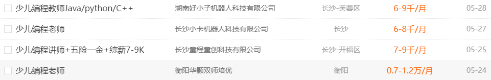
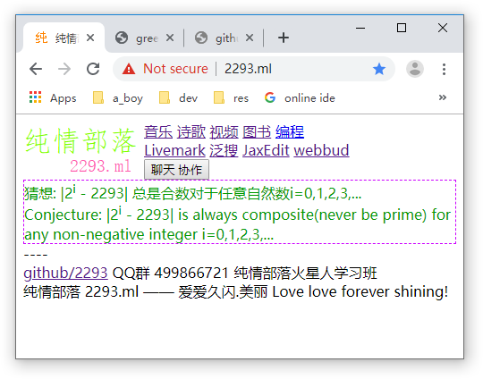

## 2019-05-29 三 阴
### 少儿编程在全国开始烽火四起
今天想到去长沙哪个少儿编程培训班做辅导。凭我喜欢超越的学习上进心和快捷明晰的学习方式，我想我领的孩子很快会变得各科成绩优异，在编程领域让老师家长们惊叹夸赞……在so.com和cn.bing.com中搜索，发现现在全国少儿编程正搞得狼烟四起征途漫漫！

- [童程童美&好小子](http://www.it61.cn)
    长沙童程童美学校：芙蓉区韶山北路169号
- [艾科思少儿编程](http://www.ikesi.cn)
- [vipcode](http://act.vipcode.com/mps/produce/1550803950515/pc/index.html?stClId=2&sLClId=0&plId=209&unId=42&kwd=5bCR5YS/57yW56iL&lGPId=195&acId=0&pSId=32&acPFlag=1&sFFlag=1&remark=360-11-PC-cs-B-00043230&djclick=1) 李开复博士投资的品牌
- [西瓜创客](https://www.xiguacity.cn) 正在全国火爆招商
- [极客晨星](https://www.jikestar.com)
    长沙校区： 湖南省长沙市开福区湘江中路万达广场2号门5楼
- [编程猫](https://hi.codemao.cn)
- [中国少儿编程网](http://www.kidscode.cn)
- [边玩边学](https://www.codepku.com)
- [妙小程](https://www.miaocode.com)
- [千里码少儿编程-缔造成都少儿编程第一品牌](http://www.qlmbc.cn)

在[51job求职网中搜索](https://search.51job.com) “少儿编程”，找到有三条信息

--------

### 程序员如何下载视频？
- 一可用python编写的开源工具you-get。
https://github.com/soimort/you-get#supported-sites

you-get -o /temp http://tv.cctv.com/2019/04/08/VIDEK0hxH6lJEgOJTBnd6Zxd190408.shtml?spm=C86503.P0gvObVdQv8q.EuofkZhc2HxM.4

pip install PySocks

you-get -s 127.0.0.1:1080 'https://www.youtube.com/watch?v=jNQXAC9IVRw'

- 二可用浏览器插件。火狐浏览器里在https://addons.mozilla.org/en-US/firefox/ 搜索"video", 就能找到
[Easy Video Downloader (Flash and Video)](https://addons.mozilla.org/en-US/firefox/addon/easy-video-downloader/?src=search) 等等好多关于视频下载的插件

- 三可用youtube-dl下载youtube上的视频
https://github.com/ytdl-org/youtube-dl

- 头条视频下载
https://miku.tools/tools/toutiao_video_downloader

- 另外下载网易云音乐可到这里试试
https://miku.tools/tools/163_music_downloader

## 2019-05-30 四 阴
### 发现两个强悍的身份证图片生成工具
发现这两个强悍的身份证图片生成工具，玩味一下，无伤大雅
- https://github.com/airob0t/idcardgenerator
- https://miku.tools/tools/idcard_generator/
    https://github.com/Ice-Hazymoon/idcard_generator

## 2019-06-03 一 晴
今天在freenom.com注册到了免费域名2293.ml, 作为我的网站【纯情部落】。
我会写一系列软件和文档，将纯情部落打造成我的软件梦工厂……

## 2019-06-15 六 晴
- Russian Aurora OS  
- Opera GX is a special version of the Opera browser built specifically to complement gaming.
- Windows 10 WSL , kali linux
- Huawei AppGallery, https://huaweimobileservices.com/appgallery/    https://appstore.huawei.com
- shodan.io

知乎sky zhou skyzhou 作为一个用node-webkit+sqlite开发pc应用的程序狗来说，PWA的前景真的很不错

## 2019-06-21 晴转阵雨

### Resource HackerTM
... a freeware resource compiler & decompiler for Windows® applications

Version 5.1.7
Last updated: 3 January 2019
Copyright © 1999-2019 Angus Johnson
Freeware - no nags, no ads and fully functional.

### Bypass Windows Logons with the Utilman.exe Trick
Utilman.exe is a built in Windows application that is designed to allow the user to configure Accessibility options such as the Magnifier, High Contrast Theme, Narrator and On Screen Keyboard before they log onto the system. The user can trigger Utilman by pressing Windows Key + U before Windows logon. If you swap the Utilman.exe file with something else like cmd.exe, you have access to the command prompt running SYSTEM privileges. Use a Boot CD like UBCD4Win and use the file management software there
Use the Windows Vista or 7 DVD
In this example we will be using the Windows 7 DVD. To begin, boot from your Windows 7 DVD and when you reach the first screen asking about the language, currency and keyboard format, Click Next.
On the next page, down in the lower left hand side, click on the “Repair your computer” link.
Next, select the “Use recovery tools that can help fix problems starting Windows. Select an operating system to repair” option, choose an operating system from the list and Click Next.
ou will now have an option to “Choose a recovery tool”. Select Command Prompt.

You should now have a Command Prompt Window open. Type in the following commands:

C:\
cd windows\system32
ren utilman.exe utilman.exe.bak
copy cmd.exe utilman.exe

This will navigate to the system32 directory, rename utilman.exe to utilman.exe.bak, make a copy of cmd.exe and name it utilman.exe.

Remove the DVD and reboot the system.

Once the computer boots up normally, press the key combination Windows Key + U and you should get a Command Prompt.

Resetting an Existing Users Password: net user JohnDoe hunter2
you can see a list of the users by typing: net user
Creating a New User Account：
net user NewGuy abc123 /add
net localgroup Administrators NewGuy /add

Reverting Changes
To restore utilman.exe, in the Command Prompt type in:
C:
cd windows\system32
del utilman.exe
ren utilman.exe.bak utilman.exe
Then reboot the system.

To remove the new user account you just created earlier, type in:
net user NewGuy /delete

### An A-Z Index of the Windows CMD command line
<pre>
   ADDUSERS Add or list users to/from a CSV file
   ADmodcmd Active Directory Bulk Modify
   ARP      Address Resolution Protocol
   ASSOC    Change file extension associations•
   ATTRIB   Change file attributes
b
   BCDBOOT  Create or repair a system partition
   BCDEDIT  Manage Boot Configuration Data
   BITSADMIN Background Intelligent Transfer Service
   BROWSTAT Get domain, browser and PDC info
c
   CACLS    Change file permissions
   CALL     Call one batch program from another•
   CERTREQ  Request certificate from a certification authority
   CERTUTIL Utility for certification authority (CA) files and services
   CD       Change Directory - move to a specific Folder•
   CHANGE   Change Terminal Server Session properties
   CHCP     Change the active console Code Page
   CHKDSK   Check Disk - check and repair disk problems
   CHKNTFS  Check the NTFS file system
   CHOICE   Accept keyboard input to a batch file
   CIPHER   Encrypt or Decrypt files/folders
   CleanMgr Automated cleanup of Temp files, recycle bin
   CLIP     Copy STDIN to the Windows clipboard
   CLS      Clear the screen•
   CMD      Start a new CMD shell
   CMDKEY   Manage stored usernames/passwords
   COLOR    Change colors of the CMD window•
   COMP     Compare the contents of two files or sets of files
   COMPACT  Compress files or folders on an NTFS partition
   COMPRESS Compress one or more files
   CONVERT  Convert a FAT drive to NTFS
   COPY     Copy one or more files to another location•
   Coreinfo Show the mapping between logical & physical processors
   CSCcmd   Client-side caching (Offline Files)
   CSVDE    Import or Export Active Directory data 
d
   DATE     Display or set the date•
   DEFRAG   Defragment hard drive
   DEL      Delete one or more files•
   DELPROF  Delete user profiles
   DELTREE  Delete a folder and all subfolders
   DevCon   Device Manager Command Line Utility 
   DIR      Display a list of files and folders•
   DIRQUOTA File Server Resource Manager Disk quotas
   DIRUSE   Display disk usage
   DISKPART Disk Administration
   DISKSHADOW Volume Shadow Copy Service
   DISKUSE  Show the space used in folders
   DISM     Deployment Image Servicing and Management
   DNSCMD   Manage DNS servers
   DOSKEY   Edit command line, recall commands, and create macros
   DriverQuery Display installed device drivers
   DSACLs   Active Directory ACLs
   DSAdd    Add items to active directory (user group computer) 
   DSGet    View items in active directory (user group computer)
   DSQuery  Search for items in active directory (user group computer)
   DSMod    Modify items in active directory (user group computer)
   DSMove   Move an Active directory Object
   DSRM     Remove items from Active Directory
   Dsmgmt   Directory Service Management
e
   ECHO     Display message on screen•
   ENDLOCAL End localisation of environment changes in a batch file•
   ERASE    Delete one or more files•
   EVENTCREATE Add a message to the Windows event log
   EXIT     Quit the current script/routine and set an errorlevel•
   EXPAND   Uncompress CAB files
   EXPLORER Open Windows Explorer
   EXTRACT  Uncompress CAB files
f
   FC       Compare two files
   FIND     Search for a text string in a file
   FINDSTR  Search for strings in files
   FLTMC    Manage MiniFilter drivers
   FOR /F   Loop command: against a set of files•
   FOR /F   Loop command: against the results of another command•
   FOR      Loop command: all options Files, Directory, List•
   FORFILES Batch process multiple files
   FORMAT   Format a disk
   FREEDISK Check free disk space
   FSUTIL   File and Volume utilities
   FTP      File Transfer Protocol
   FTYPE    File extension file type associations•
g
   GETMAC   Display the Media Access Control (MAC) address
   GOTO     Direct a batch program to jump to a labelled line•
   GPRESULT Display Resultant Set of Policy information
   GPUPDATE Update Group Policy settings
h
   HELP     Online Help
   HOSTNAME Display the host name of the computer
i
   iCACLS   Change file and folder permissions
   IEXPRESS Create a self extracting ZIP file archive
   IF       Conditionally perform a command•
   IFMEMBER Is the current user a member of a group
   IPCONFIG Configure IP
   INUSE    Replace files that are in use by the OS
l
   LABEL    Edit a disk label
   LGPO     Local Group Policy Object utility
   LODCTR   Load PerfMon performance counters
   LOGMAN   Manage Performance Monitor logs
   LOGOFF   Log a user off
   LOGTIME  Log the date and time in a file
m
   MAKECAB  Create .CAB files
   MAPISEND Send email from the command line
   MBSAcli  Baseline Security Analyzer
   MEM      Display memory usage
   MD       Create new folders•
   MKLINK   Create a symbolic link (linkd) •
   MODE     Configure a system device COM/LPT/CON
   MORE     Display output, one screen at a time
   MOUNTVOL Manage a volume mount point
   MOVE     Move files from one folder to another•
   MOVEUSER Move a user from one domain to another
   MSG      Send a message
   MSIEXEC  Microsoft Windows Installer
   MSINFO32 System Information
   MSTSC    Terminal Server Connection (Remote Desktop Protocol)
n
   NET      Manage network resources
   NETDOM   Domain Manager
   NETSH    Configure Network Interfaces, Windows Firewall & Remote access
   NBTSTAT  Display networking statistics (NetBIOS over TCP/IP)
   NETSTAT  Display networking statistics (TCP/IP)
   NLSINFO  Display locale information (reskit).
   NLTEST   Network Location Test (AD)
   NOW      Display the current Date and Time 
   NSLOOKUP Name server lookup
   NTBACKUP Windows Backup folders to tape
   NTDSUtil Active Directory Domain Services management
   NTRIGHTS Edit user account rights
   NVSPBIND Modify network bindings
o
   OPENFILES Query or display open files
p
   PATH     Display or set a search path for executable files•
   PATHPING Trace route plus network latency and packet loss
   PAUSE    Suspend processing of a batch file and display a message•
   PERMS    Show permissions for a user
   PERFMON  Performance Monitor
   PING     Test a network connection
   POPD     Return to a previous directory saved by PUSHD•
   PORTQRY  Display the status of ports and services
   POWERCFG Configure power settings
   PRINT    Print a text file
   PRINTBRM Print queue Backup/Recovery
   PRNCNFG  Configure or rename a printer
   PRNMNGR  Add, delete, list printers and printer connections
   ProcDump Monitor an application for CPU spikes
   PROMPT   Change the command prompt•
   PsExec     Execute process remotely
   PsFile     Show files opened remotely
   PsGetSid   Display the SID of a computer or a user
   PsInfo     List information about a system
   PsKill     Kill processes by name or process ID
   PsList     List detailed information about processes
   PsLoggedOn Who's logged on (locally or via resource sharing)
   PsLogList  Event log records
   PsPasswd   Change account password
   PsPing     Measure network performance
   PsService  View and control services
   PsShutdown Shutdown or reboot a computer
   PsSuspend  Suspend processes
   PUSHD    Save and then change the current directory•
q
   QGREP    Search file(s) for lines that match a given pattern
   Query Process / QPROCESS  Display processes
   Query Session / QWinsta   Display all sessions (TS/Remote Desktop)
   Query TermServer /QAppSrv List all servers (TS/Remote Desktop)
   Query User    / QUSER     Display user sessions (TS/Remote Desktop)
r
   RASDIAL  Manage RAS connections
   RASPHONE Manage RAS connections
   RD       Delete folder(s)•
   RECOVER  Recover a damaged file from a defective disk
   REG      Registry: Read, Set, Export, Delete keys and values
   REGEDIT  Import or export registry settings
   REGSVR32 Register or unregister a DLL
   REGINI   Change Registry Permissions
   REM      Record comments (remarks) in a batch file•
   REN      Rename a file or files•
   REPLACE  Replace or update one file with another
   Reset Session  Delete a Remote Desktop Session
   RMTSHARE Share a folder or a printer
   ROBOCOPY Robust File and Folder Copy
   ROUTE    Manipulate network routing tables
   RUN      Start | RUN commands
   RUNAS    Execute a program under a different user account
   RUNDLL32 Run a DLL command (add/remove print connections)

s
   SC       Service Control
   SCHTASKS Schedule a command to run at a specific time
   SET      Display, set, or remove session environment variables•
   SETLOCAL Control the visibility of environment variables•
   SetSPN   Edit Service Principal Names
   SETX     Set environment variables
   SFC      System File Checker 
   SHARE    List or edit a file share or print share
   ShellRunAs Run a command under a different user account
   SHIFT    Shift the position of batch file parameters•
   SHORTCUT Create a windows shortcut (.LNK file)
   SHUTDOWN Shutdown the computer
   SIGCHECK Display file version no. VirusTotal status & timestamp
   SLEEP    Wait for x seconds
   SLMGR    Software Licensing Management (Vista/2008)
   SORT     Sort input
   START    Start a program, command or batch file•
   STRINGS  Search for ANSI and UNICODE strings in binary files
   SUBINACL Edit file and folder Permissions, Ownership and Domain
   SUBST    Associate a path with a drive letter
   SYSMON   Monitor and log system activity to the Windows event log
   SYSTEMINFO List system configuration
t
   TAKEOWN  Take ownership of a file
   TASKLIST List running applications and services
   TASKKILL End a running process
   TELNET   Communicate with another host using the TELNET protocol
   TIME     Display or set the system time•
   TIMEOUT  Delay processing of a batch file/command
   TITLE    Set the window title for a CMD.EXE session•
   TLIST    Task list with full path
   TOUCH    Change file timestamps    
   TRACERT  Trace route to a remote host
   TREE     Graphical display of folder structure
   TSDISCON Disconnect a Remote Desktop Session
   TSKILL   End a running process
   TYPE     Display the contents of a text file•
   TypePerf Write performance data to a log file
   TZUTIL   Time Zone Utility
v
   VER      Display version information•
   VERIFY   Verify that files have been saved•
   VMConnect Connect to a Hyper-V Virtual Machine
   VOL      Display a disk label•
   VSSADMIN Display volume shadow copy backups and shadow copy writers/providers. 
w
   W32TM    Time Service
   WAITFOR  Wait for or send a signal
   WBADMIN  Windows Backup Admin
   WECUTIL  Windows Event Collector Utility
   WEVTUTIL Clear event logs, enable/disable/query logs
   WHERE    Locate and display files in a directory tree
   WHOAMI   Output the current UserName and domain
   WINDIFF  Compare the contents of two files or sets of files
   WINRM    Windows Remote Management
   WINRS    Windows Remote Shell
   WMIC     WMI Commands
   WPEUTIL  Run WinPE commands
   WPR      Windows Performance Recorder
   WUSA     Windows Update Standalone Installer
   WUAUCLT  Windows Update
x
   XCACLS   Change file and folder permissions
   XCOPY    Copy files and folders
   ::       Comment / Remark•
Commands marked • are Internal commands only available within the CMD shell.
All other commands (not marked with •) are external commands.
External commands may be used under the CMD shell, PowerShell, or directly from START-RUN

A categorized list of Windows CMD commands
Active Directory
   ADmodcmd Active Directory Bulk Modify
   CSVDE    Import or Export Active Directory data 
   DSACLs   Active Directory ACLs
   DSAdd    Add items to active directory (user group computer) 
   DSGet    View items in active directory (user group computer)
   DSQuery  Search for items in active directory (user group computer)
   DSMod    Modify items in active directory (user group computer)
   DSMove   Move an Active directory Object
   DSRM     Remove items from Active Directory

Batch Files
   CALL     Call one batch program from another•
   CHOICE   Accept keyboard input to a batch file
   CLIP     Copy STDIN to the Windows clipboard
   CLS      Clear the screen•
   CMD      Start a new CMD shell
   COLOR    Change colors of the CMD window•
   DOSKEY   Edit command line, recall commands, and create macros
   ECHO     Display message on screen•
   ENDLOCAL End localisation of environment changes in a batch file•
   EVENTCREATE Add a message to the Windows event log
   EXIT     Quit the current script/routine and set an errorlevel•
   FOR /F   Loop command: against a set of files•
   FOR /F   Loop command: against the results of another command•
   FOR      Loop command: all options Files, Directory, List•
   GOTO     Direct a batch program to jump to a labelled line•
   IF       Conditionally perform a command•
   IFMEMBER Is the current user a member of a Workgroup
   LOGTIME  Log the date and time in a file
   MAPISEND Send email from the command line
   MORE     Display output, one screen at a time
   PAUSE    Suspend processing of a batch file and display a message•
   PROMPT   Change the command prompt•
   REM      Record comments (remarks) in a batch file•
   RUN      Start | RUN commands
   RUNAS    Execute a program under a different user account
   SET      Display, set, or remove session environment variables•
   SETLOCAL Control the visibility of environment variables•
   SETX     Set environment variables
   SORT     Sort input
   SHIFT    Shift the position of batch file parameters•
   SLEEP    Wait for x seconds
   START    Start a program, command or batch file•
   TIMEOUT  Delay processing of a batch file
   TITLE    Set the window title for a CMD.EXE session•
   WAITFOR  Wait for or send a signal
   WMIC     WMI Commands
   ::       Comment / Remark•

Disk Management
   BCDBOOT  Create or repair a system partition
   BCDEDIT  Manage Boot Configuration Data
   CONVERT  Convert a FAT drive to NTFS
   CHKDSK   Check Disk - check and repair disk problems
   CHKNTFS  Check the NTFS file system
   DEFRAG   Defragment hard drive
   DISKPART Disk Administration
   DISKSHADOW Volume Shadow Copy Service
   DriverQuery Display installed device drivers
   FORMAT   Format a disk
   FREEDISK Check free disk space (in bytes)
   LABEL    Edit a disk label
   MOUNTVOL Manage a volume mount point
   NTBACKUP Backup folders to tape
   SFC      System File Checker
   VOL      Display a disk label•

Files and Folders
   ASSOC    Change file extension associations•
   ASSOCIAT One step file association
   ATTRIB   Change file attributes
   BITSADMIN Background Intelligent Transfer Service
   CACLS    Change file permissions
   CD       Change Directory - move to a specific Folder•
   CIPHER   Encrypt or Decrypt files/folders
   COMP     Compare the contents of two files or sets of files
   COMPACT  Compress files or folders on an NTFS partition
   COMPRESS Compress individual files on an NTFS partition
   COPY     Copy one or more files to another location•
   CSCcmd   Client-side caching (Offline Files)
   DEL      Delete one or more files•
   DELTREE  Delete a folder and all subfolders
   DIR      Display a list of files and folders•
   ERASE    Delete one or more files•
   EXPAND   Uncompress files
   EXTRACT  Uncompress CAB files
   FC       Compare two files
   FIND     Search for a text string in a file
   FINDSTR  Search for strings in files
   FORFILES Batch process multiple files
   FSUTIL   File and Volume utilities
   FTP      File Transfer Protocol
   FTYPE    File extension file type associations•
   iCACLS   Change file and folder permissions
   MD       Create new folders•
   MOVE     Move files from one folder to another•
   MKLINK   Create a symbolic link (linkd)
   OPENFILES Query or display open files
   POPD     Return to a previous directory saved by PUSHD•
   PsFile   Show files opened remotely
   PUSHD    Save and then change the current directory•
   QGREP    Search file(s) for lines that match a given pattern
   RECOVER  Recover a damaged file from a defective disk
   REN      Rename a file or files•
   REPLACE  Replace or update one file with another
   RD       Delete folder(s)•
   RMTSHARE Share a folder or a printer
   ROBOCOPY Robust File and Folder Copy
   SHARE    List or edit a file share or print share
   SHORTCUT Create a windows shortcut (.LNK file)
   SUBINACL Edit file and folder Permissions, Ownership and Domain
   TAKEOWN  Take ownership of a file
   TOUCH    Change file timestamps
   TREE     Graphical display of folder structure
   TYPE     Display the contents of a text file•
   WHERE    Locate and display files in a directory tree
   WINDIFF  Compare the contents of two files or sets of files
   XCACLS   Change file and folder permissions
   XCOPY    Copy files and folders

Group Policy/Windows Installer
   DevCon   Device Manager Command Line Utility 
   GPRESULT Display Resultant Set of Policy information
   GPUPDATE Update Group Policy settings
   MSIEXEC  Microsoft Windows Installer
   PsInfo   List information about a system
   PsShutdown Shutdown or reboot a computer
   REGSVR32 Register or unregister a DLL
   SHUTDOWN Shutdown the computer
   SLMGR    Software Licensing Management (Vista/2008)
   WUAUCLT  Windows Update

Networking
   ARP      Address Resolution Protocol
   BROWSTAT Get domain, browser and PDC info
   DNSSTAT  DNS Statistics
   GETMAC   Display the Media Access Control (MAC) address
   IPCONFIG Configure IP
   NET      Manage network resources
   NETDOM   Domain Manager
   NETSH    Configure Network Interfaces, Windows Firewall & Remote access
   NBTSTAT  Display networking statistics (NetBIOS over TCP/IP)
   NETSTAT  Display networking statistics (TCP/IP)
   NSLOOKUP Name server lookup
   PATHPING Trace route plus network latency and packet loss
   PsPing   Measure network performance
   PING     Test a network connection
   ROUTE    Manipulate network routing tables
   TRACERT  Trace route to a remote host

Processes
   PATH     Display or set a search path for executable files•
   PsExec   Execute process remotely
   PsKill   Kill processes by name or process ID
   PsList   List detailed information about processes
   PsGetSid Display the SID of a computer or a user
   PsSuspend Suspend processes
   SCHTASKS Schedule a command to run at a specific time
   SYSMON   Monitor and log system activity to the Windows event log
   TASKLIST List running applications and services
   TASKKILL End a running process
   TSKILL   End a running process
   TLIST    Task list with full path

Printing
   MODE     Configure a system device
   PRINT    Print a text file
   PRINTBRM Print queue Backup/Recovery
   PRNCNFG  Display, configure or rename a printer
   PRNMNGR  Add, delete, list printers and printer connections
   RUNDLL32 Run a DLL command (add/remove print connections)

Registry
   REG      Registry: Read, Set, Export, Delete keys and values
   REGEDIT  Import or export registry settings
   REGINI   Change Registry Permissions

Remote Desktop
   CHANGE   Change Terminal Server Session properties
   Query Process    Display processes (TS/Remote Desktop)
   Query Session    Display all sessions (TS/Remote Desktop)
   Query TermServer List all servers (TS/Remote Desktop)
   Query User       Display user sessions (TS/Remote Desktop)
   MSTSC    Terminal Server Connection (Remote Desktop Protocol)
   RASDIAL  Manage RAS connections
   RASPHONE Manage RAS connections
   Reset Session - Delete a Remote Desktop Session
   TSDISCON Disconnect a Remote Desktop Session
   WINRM    Windows Remote Management
   WINRS    Windows Remote Shell

Services
   CASPOL   Code Access Security Policy Tool.
   PORTQRY  Display the status of ports and services
   PsService View and control services
   SC       Service Control

System Information
   NOW      Display the current Date and Time 
   DATE     Display or set the date•
   HELP     Online Help
   LOGMAN   Manage Performance Monitor logs
   MBSAcli  Baseline Security Analyzer
   MEM      Display memory usage
   MSINFO32 System Information
   NTRIGHTS Edit user account rights
   PERFMON  Performance Monitor
   PsLogList  Event log records
   SYSMON   Monitor and log system activity to the Windows event log
   SYSTEMINFO List system configuration
   TIME     Display or set the system time•
   TypePerf Write performance data to a log file
   VER      Display version information•
   VERIFY   Verify that files have been saved•
   WHOAMI   Output the current UserName and domain

User Administration
   ADDUSERS Add or list users to/from a CSV file
   CERTREQ  Request certificate from a certification authority
   CleanMgr Automated cleanup of Temp files, recycle bin
   CON2PRT  Connect or disconnect a Printer
   CMDKEY   Manage stored usernames/passwords
   DELPROF  Delete user profiles
   DIRUSE   Display disk usage
   LOGOFF   Log a user off
   MOVEUSER Move a user from one domain to another
   MSG      Send a message
   PERMS    Show permissions for a user
   POWERCFG Configure power settings
   PsLoggedOn Who's logged on (locally or via resource sharing)
   PsPasswd   Change account password
   SUBST    Associate a path with a drive letter
</pre>

## 2019-06-22 六 阴雨
C:\Windows\SysWOW64\Macromed\Flash

https://images.offensive-security.com/virtual-images/kali-linux-2019.2-vbox-amd64.ova.torrent

http://www.autopiano.cn  https://github.com/WarpPrism/AutoPiano

https://www.screentogif.com  https://github.com/NickeManarin/ScreenToGif

## 2019-06-28 晴
20190626
爱思助手 刷机
css布局生成器
Python Tutor
pygame
有道云笔记 尤其微信公众号文章一键发送到有道云笔记的功能个人非常喜欢，体验比转发到kindle还要好上几分
sonic pi
Inpaint 去水印
一粒云盘
冰点文库是一款完全免费下载百度文库的软件
https://github.com/cfenollosa/os-tutorial

20190627
15款编程游戏
vnote
GPD pocket被称为“世上最小的笔记本电脑”，最新的Pocket 2机身最薄处仅 8mm，重量为 515g
GPD其实是由中国深圳的一家公司研发生产的。

目前GPD pocket2代，不同版本京东售价在人民币3399-4459元之间。
://www.cnbc.com/2019/03/19/google-stadia-new-streaming-game...

Mar 19, 2019 · Google unveiled its streaming game service called Stadia on Tuesday which won't require people to buy expensive gameconsoles or computers to play the latest video games.

https://github.com/zlgopen/awtk c/c++ GUI
