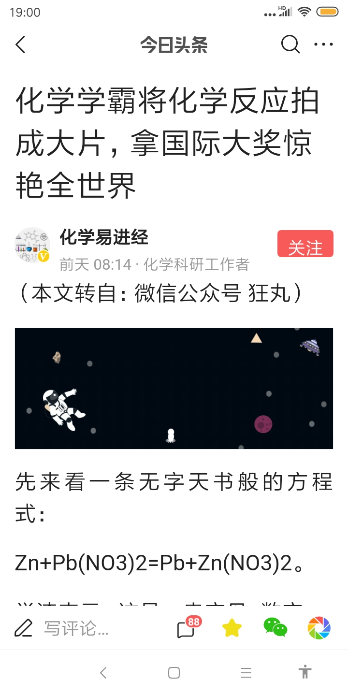
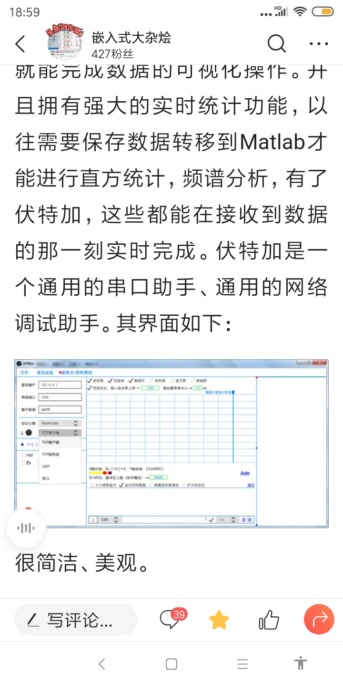
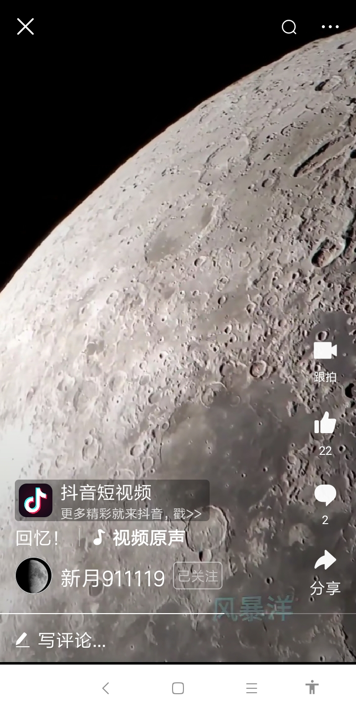

## 2019-11-20
TCC : Tiny C Compiler bellard.org/tcc/
PS D:\tcc\examples> ../tcc  .\hello_win.c
PS D:\tcc\examples> ../tcc -run .\fib.c 34

## 2019-11

## 2019-12-01

askbot.com 
https://ask.sagemath.org/questions/

## 2019-12-12

## 2019-12-18 
我的几个创想：

- 2019-12-18 03:15 三叶竖琴    
3叶*24弦，像羽毛球拍圈一样的带孔钢条，梯形框，一根弦条形方波一样穿过，中心轴自由组装1-6个琴叶; 尼龙弦，钢丝弦与电音
- 2019-12-18 03:18 江上浮板
湘江船上办公，上网,棋牌,打乒乓球，培训班，船上旅社，酒店，小超市。注册纯部科技公司，cb.com
 chun.com chun.bu 
- 湘江铁丝网箱养鱼
- 2019-11-19 浮木铁丝排钩钓鱼
- 遥控门网箱网鱼🐟
- 无人机投掷脏弹对付航母、机场、坦克，无人机脏弹会在未来战争中极大发挥作用，低成本，可以有效的延缓或迫使敌人取消进攻计划
- 

## 2019-12-22
2018年，韩国的总和生育率0.98，全球最低，成为世界上首个、也是唯一一个
生育率进入"零时代"的国家，平均一名适育年龄女性生产不足一名子女。

VOCALOID家族里的虚拟歌手

虚拟歌手 初音未来 小夕 洛天依
初音未来（初音ミク/Hatsune Miku），是2007年8月31日由CRYPTON FUTURE MEDIA以Yamaha的VOCALOID系列语音合成程序为基础开发的音源库，音源数据资料采样于日本声优藤田咲。

教你打造自己的win10精简系统:
需要的工具：
1. MediaCreationTool
2. NTLite_setup_x64.exe

DeepMind 有关 AlphaStar 的论文发表在了最新一期《Nature》杂志上，这是人工智能算法 AlphaStar 的最新研究进展，展示了 AI 在「没有任何游戏限制的情况下」已经达到星际争霸 2 人类对战天梯的顶级水平，在 Battle.net 上的排名已超越 99.8％的活跃玩家，相关的录像资料也已放出。
虽然还是打不过世界第一人类选手 Serral，但 AlphaStar 已经登上了 Nature。

一群机器狗亮相MIT，集体后空翻、踢足球这些机器狗，名叫迷你猎豹（Mini Cheetah），同样诞生于波士顿，不过来自于麻省理工学院Sangbae Kim副教授的仿生机器人实验室。
这是一种廉价、轻便的四足机器人。每只重9公斤，由12台马达驱动，续航最多能有5小时。不仅会蹦蹦跳跳，还会转圈圈。

Switch 虽然Switch没有在家玩ps4视觉体验佳，但它小巧便携，单手就可以轻松拿取。在便携程度上Switch以压倒性的优势胜过PS4；

按照原来的规划，舟甬铁路项目西起宁波东站，东到舟山，全长 77 km，其中新建铁路约 70 km，利用旧有线路约 7 km。全程需要穿过三座海岛，海岛之间用跨海大桥或者隧道连接，尤其中间北仑至金塘岛段，将打穿海底岩石建一条海底隧道。这部分隧道全长16.2 km，其中海底盾构将达到10.87 km，这也是国内首条海底高铁隧道。
按照预计，整个项目预计耗资将近300亿，勘探设计完成后将于明年正式开工。建成后，宁波市的动车到舟山只需半小时，舟甬高铁也将是全球第一条深海高铁。
事实上，海底隧道中国有好几条，比如1972年通车的香港红磡隧道，每日车流量40万辆次，还有港珠澳大桥海底隧道，集桥隧一体，全长6.7 km，但是它们的隧道长度和隧道深度都小于舟甬高铁

John O’Nolan是Ghost的创始人，从0开始到现在年收入170万美金的公司，公司有一个15人的远程工作团队。自己则一边旅行一边的工作生活，去过39个国家，400多个城市，而这种生活方式已经有差不多十年。
他INS上的图片每一张都非常的精美，都是他在旅途中的精彩瞬间

让数据库运行在浏览器里？TiDB + WebAssembly 告诉你答案

https://www.paperspace.com/tekr9c8nj/notebook/prg84pnsi

弘旺牌超迷你遥控直升机

使用正则表达式从字符串中删除HTML / XML 标记。

const stripHTMLTags = str => str.replace(/<[^>]*>/g, ''); stripHTMLTags('
<em>lorem</em> <strong>ipsum</strong>
'); // 'lorem ipsum'

据说广州的黑人已达几十万，三元里是黑人聚集的地方。

斯特林发动机模型机￥60

https://github.com/CorentinJ/Real-Time-Voice-Cloning?

华为将要发布的4款新笔记本电脑分属两个品牌，分别是：华为系的MateBook D14/D15，荣耀系的MagicBook 14/15。其中华为MateBook D系列2款新机将于11月25日发布，荣耀MagicBook 14/15将于11月26日发布。

气凝胶，最轻的固体

糖化玻璃啤酒瓶

钕磁铁

光摄原理

Python爬取今日头条指定用户发表的所有文章，视频，微头条
https://m.toutiaocdn.com/group/6763153374188700172/?app=news_article_lite&timestamp=1574678513&req_id=201911251841530100260760222104F691&group_id=6763153374188700172

国产电吹管200,￥2580

只有10岁的仲邑堇横扫日本男子职业围棋

11月30日上午，第35届中国数学奥林匹克竞赛（俗称CMO）闭幕式暨颁奖典礼隆重举行。本届比赛共有138人获得金牌，金牌分数线为54分；另外，有162人获得银牌，103人获得铜牌。团体成绩方面，团体第一是江苏队。

其中，非常值得一提的是：本届赛事的第一名是一位女生——来自江苏南师附中的严彬玮同学！并且，她还是以满分成绩夺冠的！

12岁的小吉他手女孩刘品希
全球十大最出色青少年吉他手：“速弹少女”YOYO刘品希

《世界报》5日称，法国30多个城市共有约超过18万人走上街头、组织了240多场游行。铁路职工罢工率55.6%。中小学教师罢工率分别为42%、51%。法国总工会声称在各地组织了250多场示威活动，150万名抗议者参与其中

北京时间12月9日，国际乒联北美挑战赛落下帷幕。女乒告急又丢两金！日本石川佳纯夺冠激动掩面而泣，平野美宇亚军

给长沙的朋友们推荐一个文化气息浓郁的地方：马栏山众创园，绝对值得你去看看的地方。这里有聚会不花费也不会赶人走的宽敞咖啡茶厅，有可与大学生进行头脑风暴的公共共创室，有网红们迷你型直播间，有全国性的直播园，有无人售货任买任刷屏的小超市，有坐在中厅雅座抬头可见五层楼外的蓝天白云，有你来我往你方唱罢我登场忙于拍摄视频的小哥哥小姐姐

近日， 英国《金融时报》报道称，GitHub公司首席运营官埃里卡·布雷西亚（Erica Brescia）说，由于担心美国政府的限制，GitHub正在考虑在中国成立子公司。

俄罗斯女数学家奥尔嘉-拉德任斯卡娅(Olga Aleksandrovna Ladyzhenskaya，1922~2004)出生于俄罗斯北方的一个偏远小镇，父亲在当地中学教数学而母亲则在家中操持教务

户外小型金属太阳灶

连接手机的即时中日翻译耳机

双层乒乓球

https://github.com/microsoft

河北的朱子卿乒乓球，动作很到位

外形酷似U盘的东西是日本一家公司最新研发的世界上最小的PC电脑。它的尺寸只有101×50×6毫米重量也非常轻只有141克，不管是拿在手里还是揣在兜里携带都毫无分量。如果带这个电脑出门身边的人都不会知道你竟然带了一台电脑。虽然它没有键盘屏幕，但可以通过hdmi接口和显示器连接到一起，相当于一个主机连接到显示器之后就可以像电脑一样操作，虽然小但内部的配置十分完善，配备了英特尔四核四线程处理器，拥有2GB的内存和32GB的闪存，除了USB接口和microSD卡槽，它还支持蓝牙4.0和WIFI连接。

准备注册免费域名 qing.ga

https://github.com/zhaoolee/ChromeAppHeroes

$ next_prime_delta(n^2)<=euler_phi(n) $

12 月 20 日，据外媒报道，Facebook 正在构建一个新的操作系统，以取代 Android。前微软员工， Windows NT 的合著者 Mark Lucovsky 将领导该操作系统从 0-1 的构建。Mark 目前是 Facebook 操作系统的总经理，他目前的工作重点是设计用于满足增强现实（AR）设备需求的操作系统。

vy 一个命令行的极简风格的 IDE。

https://hk.cloudbrowser.xyz:8005/?
https://free.cloudbrowser.xyz:8020/?ran=gv4b.6phis5n#oSUyH7ndX5

zim-wiki

3d打印笔

对外经贸大学虹月楼，亚洲最大的女生宿舍楼

